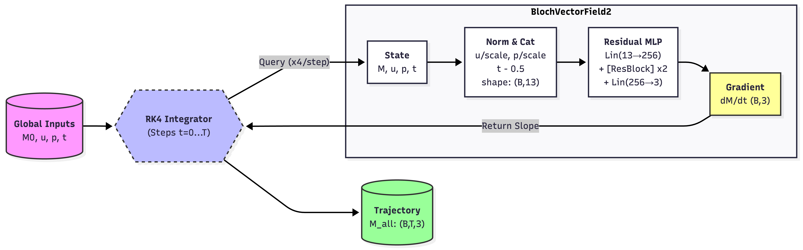
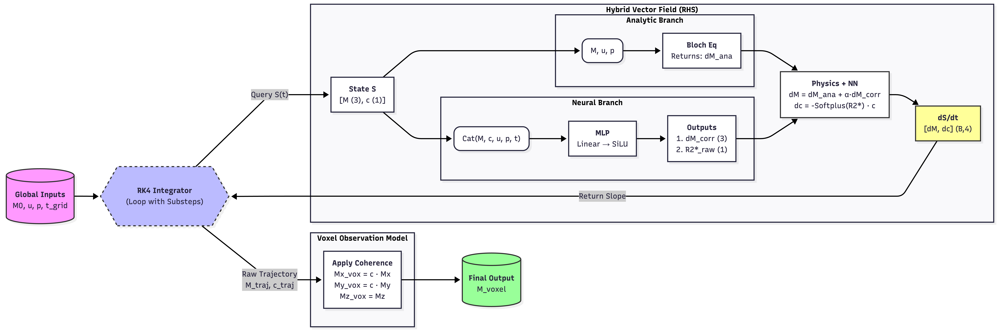

# Modelling the Bloch Equations Using Neural ODEs in Magnetic Resonance Imaging
This repository features two neural ordinary differential equations (ODEs) to model the Bloch Equations and compares the performance against numerical methods. 

## Background 
The Bloch Equations are a set of coupled, first-order, nonlinear ODEs that model the net magnetization in a magnetic field for Nuclear Magnetic Resonance (NMR) and Magnetic Resonance Imaging (MRI) applications. Analytical solutions for the Bloch Equations exist only under specific forcing functions such as time-invariant or square radio-frequency (RF) pulses, and numerical solvers can be computationally expensive. Motivated by the demand for computationally efficient methods that can tackle the complex RF forcing functions in MRI applications, this project applies neural ODEs to solve the Bloch Equations to evaluate its performance against traditional methods. 

## Methods
### Overview of Neural Network Architecture
The two neural architectures investigated include a traditional Neural ODE and a Neural Universal Differential Equation (UDE), as shown in Figure 1-2. Both models use the initial magnetization $M_0$, time $t$, control inputs $u$ (RF pulses), and physical parameters $p$ ($T_1, T_2, ∆B_0$) as inputs and both models uses a fourth-order Runge-Kutta integrator. These models were trained on a ground-truth dataset produced using `BlochSimulator`, a Python-based synthetic data generator adapted from the [Bloch Simulator](https://www.drcmr.dk/BlochSimulator/) tool made by the Danish Research Centre for Magnetic Resonance. Both single-spin and multi-spin data was generated to build this pipeline. For each of the datasets, 4000 trajectories were allocated to training, 500 to validation, and 500 to testing. Each data sample provided the RF pulse shapes, flip angles, RF amplitude, phase shift, $T_1$ and $T_2$ relaxation time constants, and field homogeneities $dB_0$.


*<b>Figure 1:</b> Neural ODE architecture with residual connections* \
The Neural ODE in Figure 1 is a data-driven multilayer perceptron with residual connections that learns the 3D Bloch Equation $\frac{d\mathbf{M}}{dt} = f_\theta(\mathbf{M}, t, \mathbf{u}(t), \mathbf{p})$ and obtains the net magnetization solution through integration. 


*<b>Figure 2:</b> Neural UDE architecture* \
The Neural UDE in Figure 2 is a physics-informed model that contains a learned correction term, governed by the 3D equation $\frac{d\mathbf{M}}{dt} = f_{Bloch}(\mathbf{M}(t), \mathbf{u}(t), \mathbf{p})+Δf_{\theta}\left(\mathbf{M}(t), t, \mathbf{u}(t), \mathbf{p}\right)$. In addition, this model has coherence terms $c(t)$ that accounts for the gradual dephasing of the individual voxel spins over time. Furthermore, to prevent underfitting, the architecture design employs 256 neurons per layer.

### Pipeline Evaluation
Pipeline evaluation was done using the synthetic dataset generated with `BlochSimulator` and the analytical solution, which is available in the time-invariant, no RF pulse case. The average mean squared error (MSE), component-wise MSE, and runtime of the numerical methods and neural approaches were compared to the analytical solution and synthetic datasets. The numerical methods used include the Euler's, 4th order Runge-Kutta, and Runge-Kutta-Fehlberg methods.

## Setup 
Run the following commands to create a Python environment. 

```
conda create -n BLOCH python=3.9
conda activate BLOCH
```
Install the dependencies using the requirements file.

```
pip install -r requirements.txt
```
Clone and open this repository 

```
git clone https://github.com/Laaaarry/Bloch-Equations-Modelling-Project.git
cd Bloch-Equations-Modelling-Project
```
## Usage

Navigate to the [Project_Pipeline.ipynb](Project_Pipeline.ipynb) file to see the fully integrated pipeline with examples. This notebook packages all of the pipeline functionalities, including synthetic data generation, neural model definitions, training loops, numerical methods, inference utilities, and comparisons of the different solvers. 